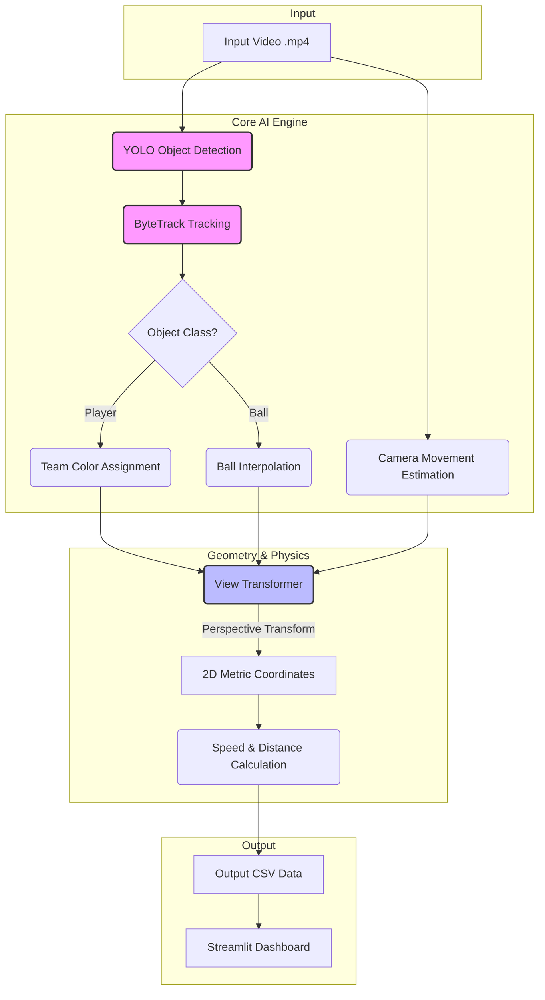

# Architektura Systemu (Pipeline)

Projekt opiera się na sekwencyjnym przetwarzaniu klatek wideo (Video Processing Pipeline). Poniższy diagram przedstawia przepływ danych od surowego pliku wejściowego do finalnego dashboardu.

## Schemat Przetwarzania Danych

