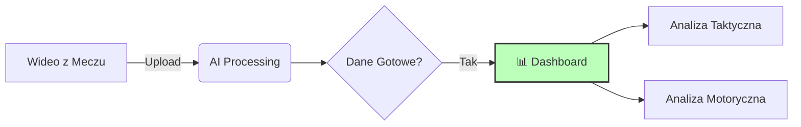

# Dashboard Analityczny

!!! abstract "Cel Biznesowy"
    Dashboard to "twarz" projektu. Jego zadaniem jest zamiana tysięcy wierszy danych w **konkretne wnioski taktyczne** dla trenera. Sztab szkoleniowy nie musi analizować surowych liczb – widzi gotowe wykresy.

---

## 🗺️ Jak to działa? (User Flow)
Schemat przepływu danych w aplikacji:

---

## ⚽ Kluczowe Moduły

### 📊 Posiadanie Piłki (Ball Possession)

* **Wizualizacja:** Wykres kołowy (Pie Chart).
* **Co widzimy:** Procentowy podział czasu gry między drużynami w skali całego spotkania.
* **Wniosek:** Pozwala określić **styl gry i dominację**. Wysoki procent (np. >60%) sugeruje drużynę prowadzącą grę atakiem pozycyjnym, podczas gdy niski procent może świadczyć o strategii opartej na głębokiej defensywie i kontratakach.

### 2. Analiza Przestrzenna (Heatmaps)

> Odpowiada na pytanie: **Jak ustawiała się drużyna?**

* **Co widzimy:** Kolorowe mapy cieplne nałożone na rzut boiska z góry.
* **Wniosek:** Trener widzi, czy zawodnicy realizowali taktykę (np. "grać szeroko skrzydłami") czy tłoczyli się w środku pola.

### 3. Parametry Fizyczne (Physical Performance)

> Odpowiada na pytanie: **Jakie są możliwości motoryczne graczy?**

* **Co widzimy:** Zestawienie całkowitego dystansu (km) pokonanego przez każdego gracza oraz jego najwyższą zarejestrowaną prędkość (km/h).
* **Wniosek:** Pozwala to na prosty podział zawodników na **wytrzymałościowców** (duży objętościowo dystans) oraz **szybkościowców** (wysoki peak prędkości), co pomaga zweryfikować ich zaangażowanie w meczu.

---

## 🛠️ Technologie (Tech Stack)

Do budowy interfejsu wykorzystano biblioteki języka Python.

| Ikona | Technologia | Zastosowanie w projekcie                                          |
| --- | --- |-------------------------------------------------------------------|
| ⚡ | **Streamlit** | Silnik aplikacji. Pozwala stworzyć stronę www w czystym Pythonie. |
| 🐼 | **Pandas** | Przetwarzanie danych. Agreguje pozycje `(x, y)` kiluset klatek.   |
| 🎨 | **Matplotlib** | Rysowanie statycznych elementów, takich jak linie boiska.         |

