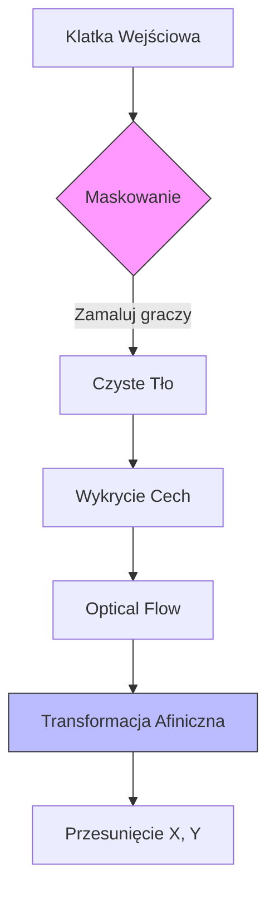

# Estymacja Ruchu Kamery (Camera Movement)

!!! danger "Problem: Ruchoma Kamera"
    Większość nagrań piłkarskich pochodzi z transmisji TV, gdzie kamera **podąża za akcją** (Zoom & Pan).
    
    Jeśli zawodnik stoi w miejscu, a kamera przesuwa się w lewo, system "myśli", że zawodnik biegnie w prawo. Aby uzyskać prawdziwe dane (prędkość, dystans), musimy **odjąć ruch kamery** od ruchu zawodnika.

---

## ⚙️ Metodologia: Optical Flow
Rozwiązanie opiera się na analizie przepływu optycznego tła (nie zawodników).

=== "🚀 Logika (Krok po kroku)"

    1.  **Inicjalizacja:** Pobieramy pierwszą klatkę i konwertujemy ją na odcienie szarości (`old_gray`).
    2.  **Maskowanie :**
         * Bierzemy pozycje wykrytych obiektów (piłkarze, piłka).
        * Zamalowujemy ich obszary na czarno na masce, aby algorytm ich **nie widział**.
        * Szukamy punktów charakterystycznych (`goodFeaturesToTrack`) TYLKO na trawie/liniach.
    3.  **Optical Flow:** Używamy metody **Lucas-Kanade**, aby sprawdzić, gdzie te punkty przesunęły się w nowej klatce.
    4.  **Estymacja Ruchu:**
        * Funkcja `cv2.estimateAffinePartial2D` oblicza macierz przesunięcia na podstawie ruchu punktów tła.
        * Wyciągamy wartości `x` i `y` (przesunięcie kamery).

=== "🐍 Implementacja (Python)"

    Kluczowe funkcje z biblioteki **OpenCV**, których używamy w pipeline:

    ```python title="camera_movement_estimator.py"
    def get_camera_movement(self, frames, annotations):
        # ... pętla po klatkach ...
        
        # 1. Stwórz maskę (wszystko białe)
        mask_features = np.zeros_like(old_gray)
        mask_features[:] = 255

        # 2. Wygnij z maski obszary gdzie są ludzie (na czarno)
        for bbox, class_id in annotations[frame_num]:
            if class_id == 2 or class_id == 3: # Player or Ball
                x1, y1, x2, y2 = bbox
                mask_features[int(y1):int(y2), int(x1):int(x2)] = 0

        # 3. Znajdź punkty tylko na boisku (omijając graczy)
        old_features = cv2.goodFeaturesToTrack(
            old_gray, 
            mask=mask_features, 
            **self.features
        )
        
        # 4. Oblicz przesunięcie kamery (Affine Transform)
        m, _ = cv2.estimateAffinePartial2D(good_old, good_new)
        camera_movement_x = m[0, 2]
        camera_movement_y = m[1, 2]
    ```
---

## 📊 Wizualizacja Procesu

