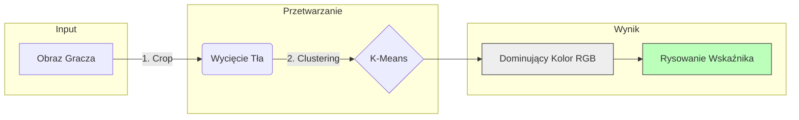

# Przypisanie Drużyn (Team Classification)

!!! abstract "Cel Modułu"
    System musi automatycznie zdecydować, czy wykryty zawodnik należy do **Drużyny A**, **Drużyny B**, czy jest **Sędzią**. 
    
    Zamiast trenować ciężkie sieci neuronowe na konkretne koszulki (które zmieniają się co sezon), wykorzystujemy uniwersalną metodę **uczenia nienadzorowanego (Unsupervised Learning)**.

---

## ⚙️ Pipeline Klasyfikacji

Cały proces odbywa się dla każdego wykrytego obiektu (bounding box) osobno.


## 🧠 Szczegóły Techniczne: K-Means
Musimy odróżnić kolor koszulki od tła, aby nadać graczowi odpowiedni kolor wskaźnika.

!!! failure "Wyzwanie: Szum w danych" 
Wewnątrz ramki z piłkarzem znajduje się nie tylko koszulka, ale też:

* 🩳 Spodenki i skarpety (często w innym kolorze).
* 🦵 Skóra zawodnika.
* 🌱 **Zielona trawa** (największy problem, bo często zajmuje 40% ramki).
!!! success "Nasze Rozwiązanie: 3-Etapowa Filtracja"
Aby wyciągnąć "prawdziwy" kolor koszulki, stosujemy następujący proces:

1.  **Maskowanie:** Najpierw programowo odfiltrowujemy piksele w odcieniach zieleni, usuwając trawę.
2.  **Klastrowanie:** Pozostałe piksele grupujemy metodą **K-Means**. Algorytm szuka dominujących "środków ciężkości" kolorów.
3.  **Wizualizacja:** Pobieramy kolor centrum klastra (RGB) i używamy go do narysowania kółka pod zawodnikiem.
=== "🐍 Implementacja (Python)"

Wykorzystujemy bibliotekę `sklearn` do szybkiego grupowania kolorów.

```python title="team_assigner.py"
from sklearn.cluster import KMeans

def get_player_color(image_crop):
    """
    Zwraca dominujące kolory gracza (bez tła).
    """
    # 1. Zmiana obrazu 2D na listę pikseli
    image_2d = image_crop.reshape(-1, 3)
    
    # 2. Uruchomienie K-Means (szukamy 2 klastrów: strój + reszta)
    kmeans = KMeans(n_clusters=2, random_state=0)
    kmeans.fit(image_2d)
    
    # 3. Pobranie centrów klastrów
    colors = kmeans.cluster_centers_
    
    return colors
```
##  🔍 Wyjątki (Corner Cases)
!!! warning "Problem: Bramkarze" 
Bramkarze zawsze mają stroje w innym kolorze niż reszta drużyny. Algorytm przypisujący kolory może się na nich pomylić.

**Rozwiązanie:** System traktuje klasę `goalkeeper` (wykrytą przez YOLO) priorytetowo, ignorując analizę kolorów.