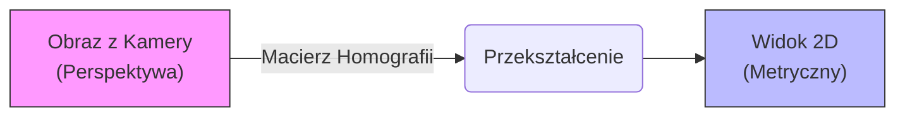

# Transformacja Perspektywy (View Transformer)

!!! abstract "Cel Modułu"
    Kamery telewizyjne pokazują obraz "płaski", ale pod kątem. Aby zmierzyć, ile metrów przebiegł zawodnik, musimy przekształcić ten widok na rzut **"z lotu ptaka" (Bird's Eye View)**.

---

## 📐 Koncepcja Działania

Musimy przekształcić trapez (widok kamery) w prostokąt (rzut boiska).



---

## Dlaczego to jest trudne?

Występuje tu zjawisko **skrótu perspektywicznego**.

!!! failure "Problem: Piksele ≠ Metry"
Na surowym wideo zawodnik biegnący przy linii bocznej (blisko kamery) wydaje się poruszać szybciej i pokonywać więcej pikseli niż ten sam zawodnik biegnący po drugiej stronie boiska.

!!! success "Rozwiązanie: Homografia"
Wyznaczamy 4 punkty na boisku (np. rogi pola karnego), których prawdziwe wymiary znamy, i na ich podstawie "rozciągamy" obraz.

---

Matematyka i Implementacja

=== "🧮 Teoria (Macierz)"

System wykorzystuje **macierz homografii $H$** o wymiarach $3 \times 3$. Mapuje ona punkty z obrazu źródłowego (kamera) na obraz docelowy (model boiska).

Dla każdego punktu $P_{img} = [x, y, 1]^T$ na obrazie, obliczamy punkt na boisku $P_{pitch} = [x', y', 1]^T$:

$$
\begin{bmatrix} x' \\ y' \\ w \end{bmatrix} = 
\begin{bmatrix} 
h_{11} & h_{12} & h_{13} \\ 
h_{21} & h_{22} & h_{23} \\ 
h_{31} & h_{32} & h_{33} 
\end{bmatrix} 
\begin{bmatrix} x \\ y \\ 1 \end{bmatrix}
$$

Gdzie finalne współrzędne metryczne to:

$$X_{metric} = \frac{x'}{w}, \quad Y_{metric} = \frac{y'}{w}$$

=== "🐍 Implementacja (Python)"
W kodzie wykorzystujemy bibliotekę **OpenCV**. Kluczową funkcją jest `cv2.perspectiveTransform`.

```python title="view_transformer.py"
def transform_point(self, point):
    """
    Przekształca punkt z perspektywy kamery na metry (2D).
    """
    point = np.array(point)
    p = (int(point[0]), int(point[1]))
    
    # 1. Sprawdź, czy punkt znajduje się wewnątrz zdefiniowanego obszaru boiska
    # (Ignorujemy trybuny i bandy reklamowe)
    is_inside = cv2.pointPolygonTest(self.pixel_vertices, p, False) >= 0
    
    if not is_inside:
        return None # Odrzucamy punkt

    # 2. Przygotuj format danych dla OpenCV
    reshaped_point = point.reshape(-1, 1, 2).astype(np.float32)
    
    # 3. Wykonaj transformację perspektywiczną
    transform_point = cv2.perspectiveTransform(
        reshaped_point, 
        self.perspective_transformer
    )

    return transform_point.reshape(-1, 2)
```

---

## Wynik Działania

!!! info "Co zyskujemy?"
Dzięki tej operacji każda pozycja zawodnika `(x, y)` jest wyrażona w **metrach**, co pozwala na obliczenie:

```
* ✅ Przebytego dystansu (km)
* ✅ Prędkości chwilowej (km/h)
* ✅ Heatmapy (gdzie przebywali najczęściej)

```

